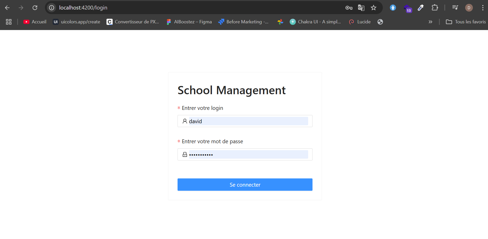
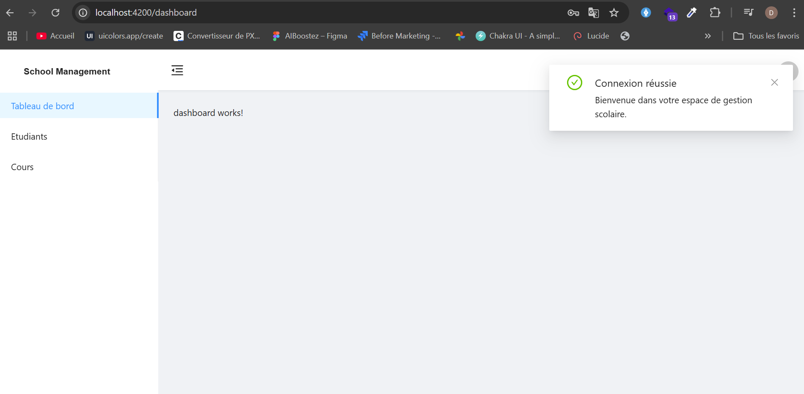
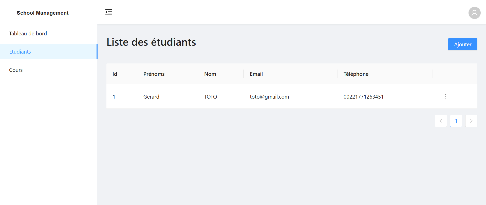
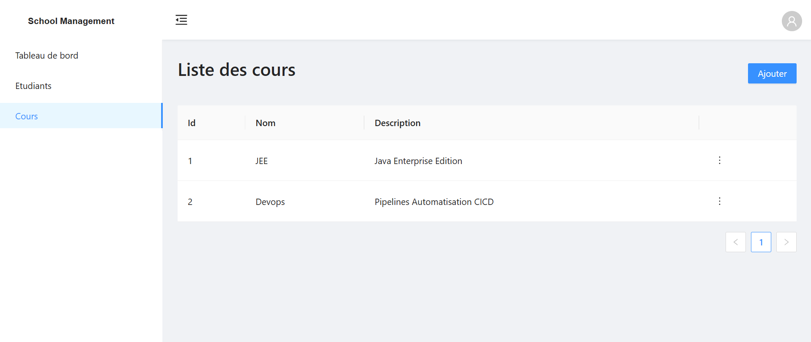
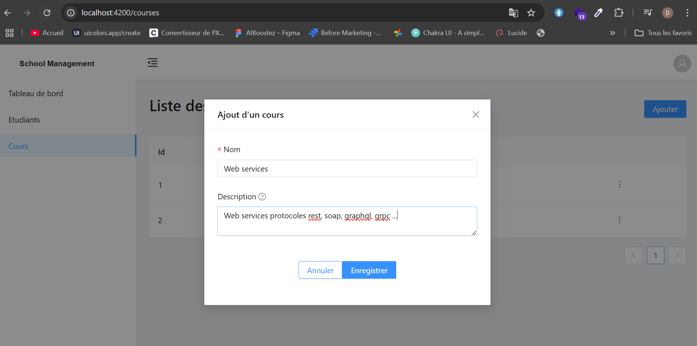
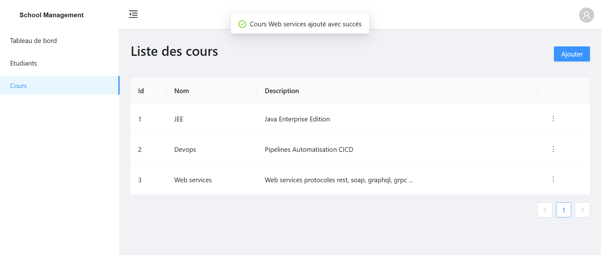
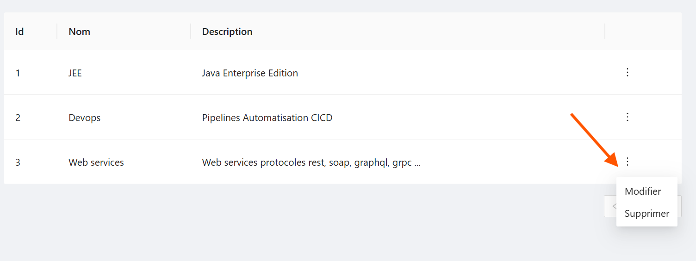
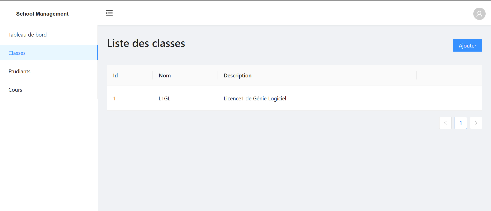

# **David GABIAM**

# Microservices school manag app

Ce projet met en pratique les microservices. On y retrouve l'utilisation de **spring cloud** comme api gateway, la discovery **eureka** pour la régistration des services ,  la gestion de la sécurité avec l'outil **Keycloak**, la gestion des logs avec
**log4j**, l'implémentation des test unitaires avec **junit** , un minifront en **angular**. 

✍ **Auteur** : @mrDav90
